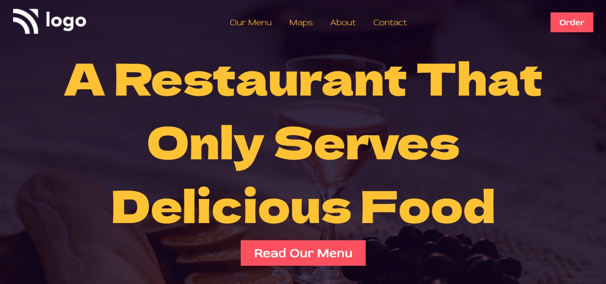

# Food Restaurant Landing Page

Made by **Omprasad Dornala**

## Description

This page focuses on positioning of elements and gradient over an image.

## Built with

- Semantic HTML
- CSS

## Key learnings

- Absolute positioning of elements.
- Using image as whole website background.
- To apply gradient over an image.

## Time taken

- This project took me more than 2hrs of time.

## Deployed Version Link

- [Live Demo](https://food-restaurant-landing-page-op.netlify.app/)

## Snapshot of Webpage

